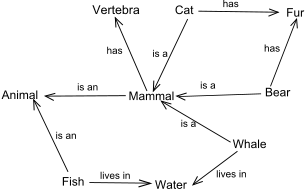

## Introduction
The core of this project is to explore human cognition and intelligence through computing. This paper will discuss the development of agents that utilize theoretical frameworks encompassing Semantic Nets and Generate and Test in order to simulate human intelligence.

## Background 
Within the spectrum of artificial intelligence, ranging from optimal machine learning techniques to auto pilot systems, we will focus on knowledge based, or cognitive, artificial intelligence. In a word, these techniques focus on artificial intelligence that _think_ like humans. 

Intelligence may be described as an ability to perceive some information and generate some form of knowledge representation to apply it for problem solving in a certain context. 

A visual-oriented way of measuring ones intelligence is through the Raven's Progressive Matrices test. It is a test in which the user examines a matrix of images, determines shape relationships and transformations amongst those objects, and picks the most likely answer from a set of images.

*Figure 1: Raven's Progressive Matrices*

_Codifying_ the cognitive processes in which we solve Raven's Progressive Matrices will enable a deeper understanding of intelligence and the results may be extrapolated to visual spacial problems in different domains. 

The end goal for this project is not to develop the best computer algorithm for the problem- it is to do so in a way that gives us insight into the way humans use intelligence and cognition to solve visual-spatial problems.

## Problem Overview
The framework we delve into for knowledge representation will be Semantic Nets. For problem solving we discuss Generate and Test. 

In general, to begin solving a knowledge based problem, the act of _knowledge representation_ is required. For this project we select Semantic Networks in order to describe the nodes, their relations to one another and transformations, and applied semantic meanings to said relations.

*Figure 2: Semantic Network*

After constructing said knowledge representation, we employ a framework, Generate and Test, to generate possible solutions based on the semantic net transformations and test them accordingly.

Since the learning goal is to explore _human-like intelligence_ by solving Raven's Progressive Matrices, it is natural to begin this investigation with how I would solve this problem without computing. 

Given a general two-by-two matrix in Figure 1 above, I immediately glance at the overall shapes and colors of the problems, if they are all black or white squares for example, to determine if the puzzle is trivial enough to simply pick the answer from the set. This is a preprocessing step I consider to reduce the answer set. This is an ideal method when shapes are singular and bottom level in each frame, in that they do not have shapes embedded within or sibling shapes.

If the puzzle is non-trivial, I first study the differences between the frames in the top row, A and B. Next, I would study the differences between the frames in the first column, A and C. Lastly, I would study the differences between the diagonal frames, B and C.

I then pick a frame in the answer set and compare it against frame B for any differences. If those differences are similar to the differences I noted between A and C, it is a column oriented transform and I make a mental note of that answer frame. I compare the answer frame diagonally with A and compare those results to the difference I noticed for B and C, if there is a match it is a diagonal oriented transform. Lastly, I compare the answer frame to C and compare that result to the differences of A and B, if there is a match it is a row oriented transform. As I come across two compared transformations, and one attribute seems off, for example maybe the colors match but one is rotated, it lessens my "confidence" for that match. This confidence is what I try to codify in the appropriate section. I continue this process for all frames in the answer set. It may be efficient to stop once I find the first match, but I am not confident yet in that conjecture without testing.

## Design & Implementation Overview
Each frame may be represented as a Semantic Net. The nodes are related to one another by directional links to establish a structure with semantic labels to provide inference. The proposed data structure to represent this description is an acyclic, directed, weighted graph. 

A graph is a data structure described by _vertices_ and _edges_. The vertices are analogous to Raven's objects, or shapes. Directional edges connect the objects to form a structure for relations and transformations, and the weights for each edge may be semantic labels.

A Generator module will be programmed to generate the transformation graphs and a tester module will be needed to test each answer frame and calculate scores of similarity.

The work flow for generating the Semantic Nets is the following:

1. Create a weighted graph for each frame
2. Generate a row-wise transformation graph (e.g., A to B)
3. Generate a column-wise transformation graph (e.g., A to C)
4. Generate a diagonal-wise transformation graph (e.g., B to C)
5. Generate a row-wise transformation graph for the variable frame (e.g., C to x)
6. Generate a column-wise transformation graph for the variable frame (e.g., B to x)
7. Generate a diagonal-wise transformation graph for the variable frame (e.g., A to x)
8. Test the _similarities_ between each transformation graph for the problem frames against each transformation graph with respect to frame x.

#### Naive Strategy
The initial strategy involves comparing the transformation weights from one transformation graph to the other. This excludes node similarities and specific transformation details- e.g., a shape transformation that begins as a very small square to a medium circle will be chalked up to a [_transformation_]. As an example, we take the graphs from steps 2 and 5 and generate a sequence of transformation labels respectively. If the labels from graph 2 contain [_add, add, unchanged_], and the labels from graph 5 contain [_add, add_], the score for this similarity would be the sum of matches between graph 2 and 5 divided by the total number of labels in graph 2.

### Robust Strategy
The naive strategy was tested on simple problem sets, particularly ones without embedded shapes, successfully. For frames with _n_-objects, a more robust strategy is required. Namely, we need to compare the object relations, such as structure sequence and object counts, amongst the graphs. Secondly, we must account for transformations in _both_ directions, e.g., a small square to a large circle may have the following transformations:

1. "transformation, expansion"
2. "transformation, shrink"

Additionally, for more complex representations a weighting system will be required to handle similarity scores in ambiguous cases. This will prove useful when the agent has to decide between two answers that yielded the same similarity score. If we employ weights, say on a transformation in which the agent cannot decide if it has been rotated or reflected, it will choose the former if we weighted that option higher than a reflection.

## Citations

Winston, Patrick Henry. _Artificial Intelligence_. Addision-Wesley Publishing Company, 1992.

